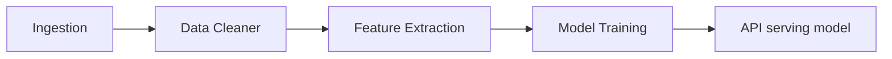

# Pipeline Outline

The technical architecture of the project.

## Data Ingestion

We expose a gRPC/REST API to allow us to control what data we're processing.
The main idea here is to expose a very lightweight service that allows us to hit the NHL API, collect data, and upload that data to pachyderm.

We then pass that data into a cleaning/transformation pipeline that takes the raw data and cleans it up, and transforms it into a format that is more useful for our model.

## Feature Extraction

Secondly we have the extraction pipeline. This pipeline takes stats and transforms them into something usable for the training pipeline. A lot of data like goals/assists translate very nicely into training models, however some data like where the game is/time of day, etc is a bit more difficult to use. We'll need to do some feature engineering to make this data usable.

Note: We may in the future be able to feed data back into the model. For example, it's more impressive if a player scores against a hot goalie/shutdown defencemen rather than a cold goalie/rookie defencemen. We can use this data to help train our model.

## Model Training

Thirdly we do the exciting thing. Training a model. We'll use the data we've collected and the features we've extracted to train a model. We'll use this model to predict how good a player will be.

## Model Serving

Lastly we'll serve our model. We'll expose a gRPC/REST API that allows us to query our model and get predictions.
