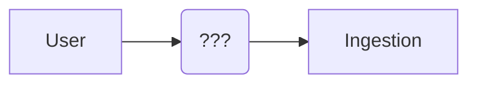
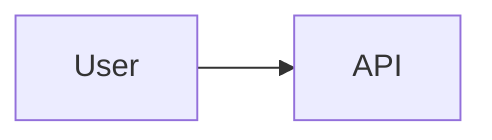

# User Guide

The user journeys a person might take.

## TODO: Updating the Model

Eventually, we'll have a UI that allows you to upload data as you see fit, currently this is done through the gRPC API on a player by player basis.

I'm more inclined to make a CLI tool that allows you to upload data, as it's easier for me to make.

## TODO: Querying the Model

We expose a gRPC/REST API to allow us to query the model and get predictions.